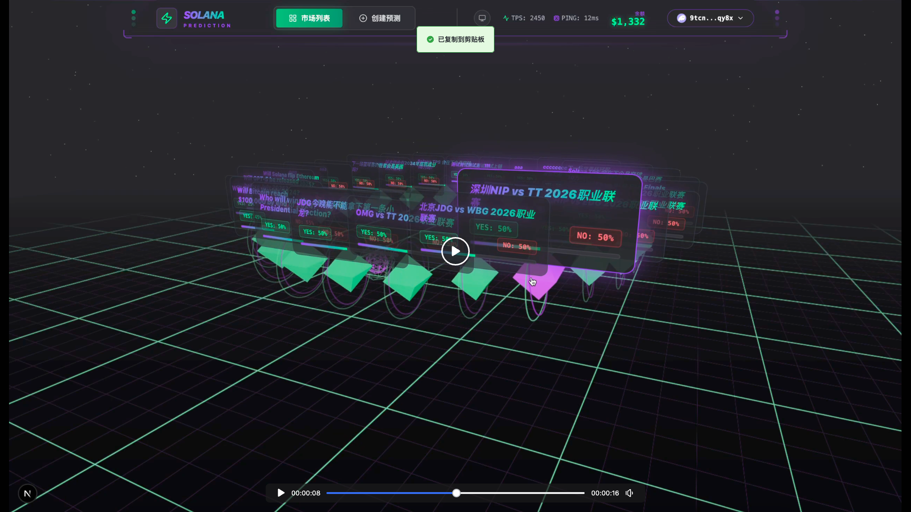
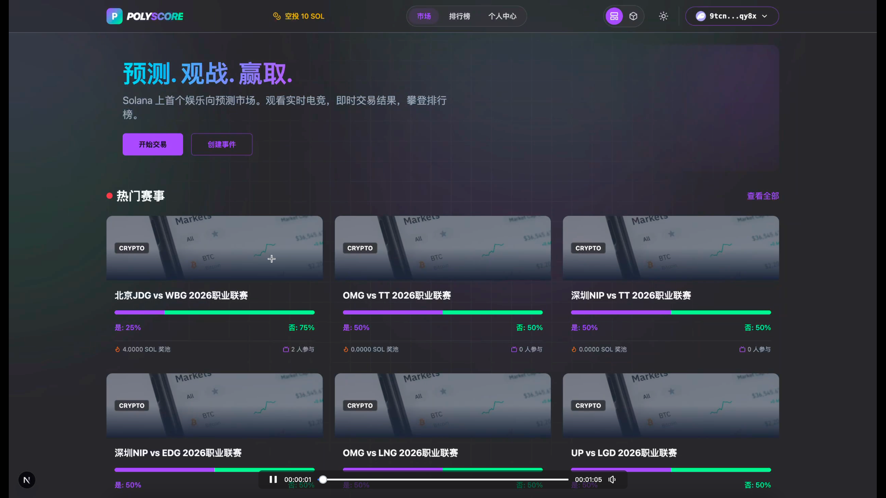
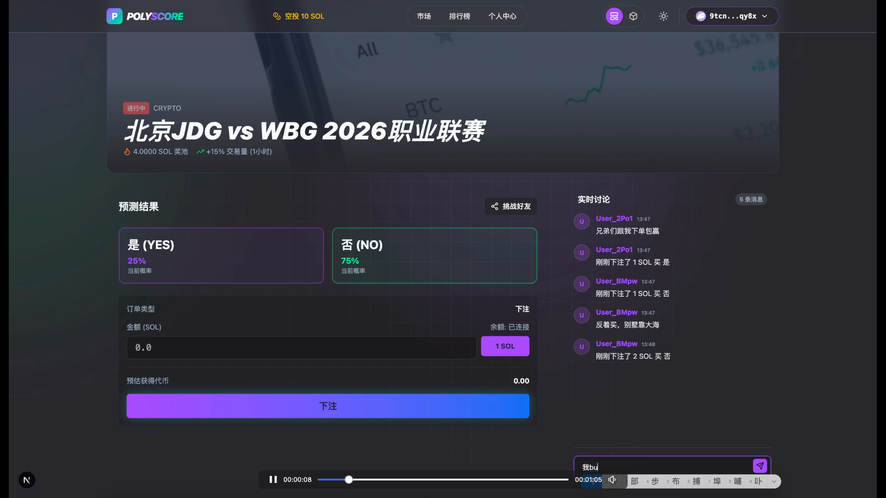
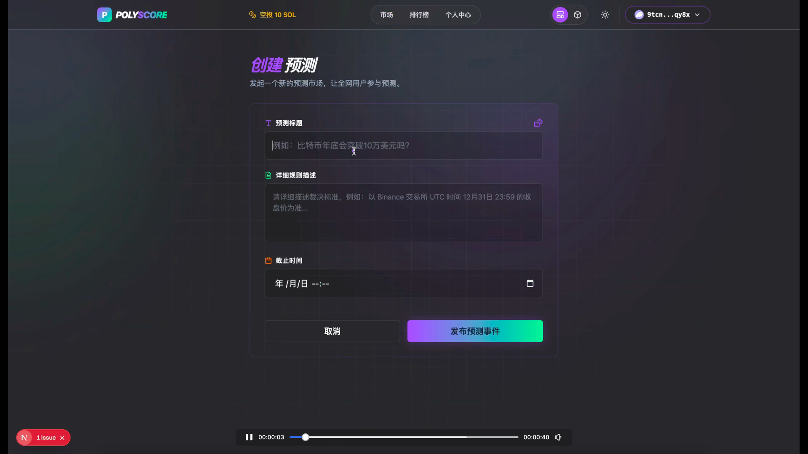
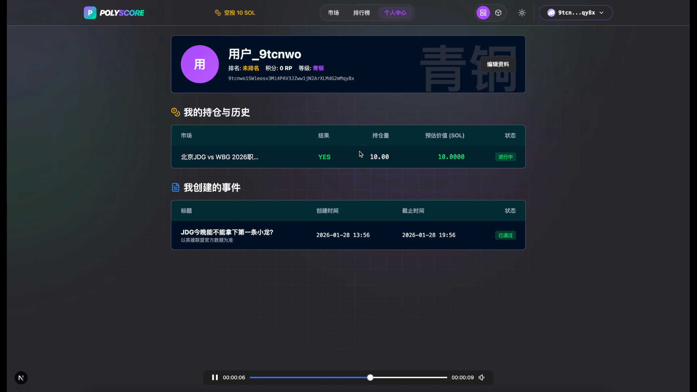
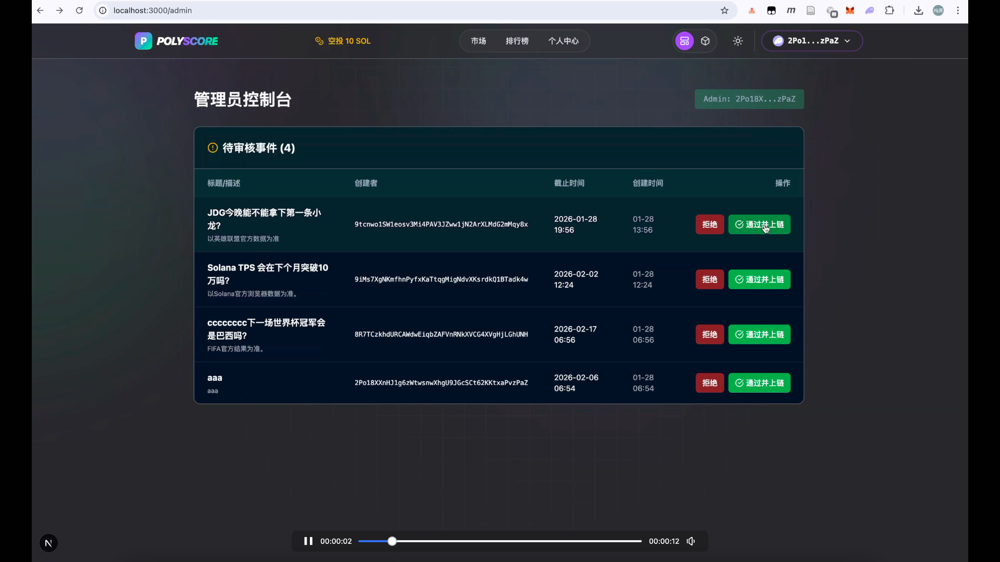
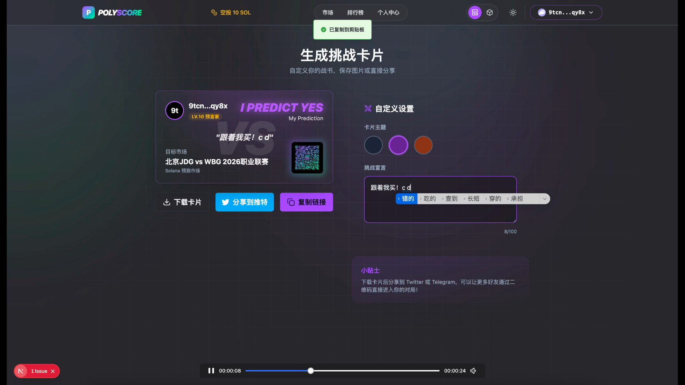

# PolyScore (Web3 Awesome Solana Market)


> 💖 **致谢与致敬**
>
> 本项目由四位 Web3 Solana 领域的初学者共同打造。在黑客松倒计时的无数个深夜里，我们并肩作战，从零开始探索 Anchor 协议与链上交互。克服了重重技术壁垒，最终在截止前的最后一刻完成了这个作品。
>
> 特别感谢每一位成员的坚持与付出：
> - [Btrain](https://github.com/bcy97)
> - [Jade](https://github.com/JadeTwinkle)
> - [Livian](https://github.com/TLwen114514)
> - [peihao](https://github.com/aiyoudiao)

**PolyScore** 是一个基于 Solana 构建的沉浸式体育/电竞预测市场平台。它打破了传统预测市场的枯燥表格形式，通过 Web3 技术与 3D 可视化交互的结合，为用户提供像“看比赛、切视角”一样直观、有趣的链上竞猜体验。

> 🏆 本项目旨在参加 Solana 黑客松，探索 Consumer Crypto 应用的新形态。[👉 点击查看参赛推文](https://x.com/Aiom09/status/2016464207295009053?s=20)

> ⚠️ **关于在线演示**: GitHub 仓库 Website 设置的访问地址 prediction-market-dapp.netlify.app 仅为 **部分纯前端 UI 演示**，由于时间仓促，连接智能合约与后端服务的功能并未在线上联调。如需体验完整交互功能，请参考下方的 [快速开始](#-快速开始) 在本地运行完整版，本地版本包含了 **前后端+智能合约测试的完整交互版本**。

## 🎥 演示视频

> 观看项目演示，感受沉浸式 Web3 预测市场的魅力。

[点击观看演示视频](./video/4ba995fdf31165b0409552e043d2d151_raw.mp4)

## 📸 精彩截图 (Screenshots)

> 💡 **提示**: 2D/3D 双模式切换，满足不同用户需求。

| 3D 沉浸式大厅 | 2D 极简列表 |
| :-: | :-: |
|  |  |

| 市场详情与交易 | 链上支付交互 |
| :-: | :-: |
|  |  |

| 创建预测事件 | 个人中心 |
| :-: | :-: |
|  |  |

| 管理员后台 | 社交分享卡片 |
| :-: | :-: |
|  |  |

## ✨ 核心特性

- **沉浸式 3D 体验**: 基于 React Three Fiber 打造的“赛博朋克”风格 3D 大厅与市场详情页，让交易不再单调。
- **双模式切换**: 支持一键切换 **2D 极简模式** (高效交易) 与 **3D 沉浸模式** (视觉享受)。
- **Solana 极速结算**: 利用 Solana 的高 TPS 与低 Gas 特性，实现毫秒级下单与即时链上交互。
- **社交化挑战**: 生成专属“挑战卡片”，支持一键分享至 Twitter/Telegram，邀请好友链上对决。
- **实时动态**: 集成实时赔率变化与弹幕式交易流，营造紧张刺激的观赛氛围。

## 🛠 技术栈

本项目采用现代化的全栈开发架构：

### 前端与交互
- **框架**: [Next.js 16](https://nextjs.org/) (App Router) + React 19
- **语言**: TypeScript
- **样式**: Tailwind CSS + Framer Motion (动画)
- **3D 引擎**: [React Three Fiber](https://docs.pmnd.rs/react-three-fiber) + Drei + Three.js
- **状态管理**: Zustand + TanStack Query

### 区块链与 Web3
- **网络**: Solana (Devnet/Mainnet)
- **合约框架**: [Anchor](https://www.anchor-lang.com/) (Rust)
- **SDK**: `@solana/web3.js`
- **钱包适配**: Solana Wallet Adapter (支持 Phantom, Solflare, Backpack 等)

### 后端与数据
- **BaaS**: [Supabase](https://supabase.com/) (PostgreSQL 数据库)
- **API**: Next.js API Routes (Serverless)

## 🚀 快速开始

### 前置要求
- [Node.js](https://nodejs.org/) (推荐 v20 LTS 或更高版本)
- [pnpm](https://pnpm.io/) (包管理器)
- [Rust & Anchor](https://www.anchor-lang.com/docs/installation) (用于合约开发与部署)
- [Solana CLI](https://docs.solanalabs.com/cli/install) (用于链上交互)
- 一个 Solana 钱包 (如 Phantom)

### 1. 克隆项目
```bash
git clone https://github.com/aiyoudiao/web3-awesome-solana-market.git
cd web3-awesome-solana-market
```

### 2. 智能合约部署 (Contract)

本项目包含完整的 Solana 智能合约 (`soldora`)。默认配置已调整为连接 **Devnet 测试网**。您也可以选择部署到本地测试链 (Localnet)。

#### 选项 A: 部署到 Devnet (推荐)

如果您希望应用连接到公共测试网络，请执行以下步骤：

1. **配置 Solana CLI 为 Devnet**
   ```bash
   solana config set --url devnet
   ```

2. **准备钱包与 SOL**
   确保您有生成的钱包密钥对，并领取 Devnet 测试币：
   ```bash
   # 如果没有钱包，生成一个新的 (默认路径 ~/.config/solana/id.json)
   solana-keygen new

   # 领取测试币 (Devnet 限制较多，可能需要多次尝试或使用水龙头网站)
   solana airdrop 2
   ```
   
   > ⚠️ **空投失败怎么办？**
   > 如果 CLI 提示 `Rate limit reached`，请尝试以下网页水龙头领取：
   > - [Solana Faucet](https://faucet.solana.com/)
   > - [Web3.js Faucet](https://solfaucet.com/)
   > - [QuickNode Faucet](https://faucet.quicknode.com/solana/devnet)

3. **构建与获取 Program ID**
   ```bash
   cd contract
   
   # 安装依赖
   yarn install

   # 构建合约
   anchor build
   
   # 获取生成的 Program ID
   solana address -k target/deploy/soldora-keypair.json
   ```

4. **更新 Program ID**
   - 复制上一步获取的 Program ID。
   - 打开 `contract/Anchor.toml`，更新 `[programs.devnet]` 下 `soldora` 的值为新的 ID。
   - 打开 `src/idl/soldora.json`，更新 `address` 字段为新的 ID。

5. **重新构建并部署**
   ```bash
   # 重新构建 (确保 IDL 中包含正确的地址)
   anchor build
   
   # 部署到 Devnet
   anchor deploy --provider.cluster devnet
   ```

#### 选项 B: 部署到 Localnet (本地调试)

1. **启动本地测试链**
   ```bash
   solana-test-validator
   ```

2. **配置并部署**
   ```bash
   # 配置为本地网络
   solana config set --url localhost
   
   # 部署
   cd contract
   anchor deploy --provider.cluster localnet
   ```

3. **注意**
   如果使用 Localnet，请务必将 `src/components/WalletContextProvider.tsx` 中的 `network` 设置改回 `WalletAdapterNetwork.Localnet` 或手动指定 `endpoint` 为 `http://127.0.0.1:8899`。

> 💡 **提示**: 
> 1. 部署成功后，请务必将生成的 Program ID 更新到 `Anchor.toml` 和前端 IDL 文件 `src/idl/soldora.json` 中的 `address` 字段。
> 2. 如果修改了 Program ID，需要重新运行 `anchor build` 和 `anchor deploy`。

### 常见问题排查 (Troubleshooting)

**Q: 部署时提示 `Operation timed out` 或 `Blockhash expired`？**
A: 这是 Devnet 公共节点拥堵导致的。请尝试以下方法：

1. **更换 RPC 节点**：
   尝试使用其他公共节点进行部署：
   ```bash
   solana program deploy contract/target/deploy/soldora.so --url https://devnet.genesysgo.net
   ```

2. **检查并回收资金**：
   部署超时失败可能会留下占用 SOL 的缓冲区账户 (Buffer Account)。
   ```bash
   # 查看是否有残留的缓冲区
   solana program show --buffers
   
   # 关闭缓冲区回收 SOL (替换 <BUFFER_ADDRESS> 为实际地址)
   solana program close <BUFFER_ADDRESS>
   ```

### 3. 前端启动 (Frontend)

回到项目根目录，启动前端应用。

```bash
# 回到根目录
cd ..

# 安装依赖
pnpm install

# 配置环境变量
# 复制 .env.example 到 .env.local 并填入 Supabase 配置
cp .env.example .env.local
```

```bash
# 启动开发服务器
pnpm dev
```

打开浏览器访问 [http://localhost:3000](http://localhost:3000) 即可开始体验。

## 📂 项目结构

```
.
├── contract/              # Solana 智能合约 (Anchor 框架)
│   ├── programs/          # 合约源码 (Rust)
│   ├── tests/             # 合约测试
│   └── Anchor.toml        # Anchor 配置文件
├── src/
│   ├── app/               # Next.js App Router 页面与 API 路由
│   │   ├── api/           # 后端 API 逻辑 (创建市场, 用户数据, 下注)
│   │   ├── market/        # 市场详情页
│   │   ├── create/        # 创建预测页
│   │   └── ...
│   ├── components/        # React 组件
│   │   ├── 3d/            # 3D 场景组件 (Avatar, Environment, Models)
│   │   ├── ui/            # 通用 UI 组件 (Buttons, Modals)
│   │   └── ...
│   ├── lib/               # 工具函数, API 封装, Store 定义
│   └── hooks/             # 自定义 React Hooks
├── supabase/              # Supabase 数据库迁移文件
├── video/                 # 项目演示视频
└── ...
```

## 🗺️ 路线图 (Roadmap)

### ✅ Phase 1: 核心功能与 MVP (已完成)
- **沉浸式交互**: 
  - [x] 搭建 Cyberpunk 风格 3D 大厅与市场场景 (R3F)
  - [x] 实现 2D/3D 视图一键无缝切换
- **智能合约 (Soldora)**:
  - [x] 基于 Anchor 构建预测市场核心合约
  - [x] 实现 Create Event (管理员), Bet (用户), Resolve (结算), Redeem (兑奖)
  - [x] 2% 手续费 Treasury 机制
- **基础业务**:
  - [x] Solana 钱包连接 (Wallet Adapter)
  - [x] 市场列表与详情页展示
  - [x] 实时评论系统 (Supabase)
  - [x] 个人中心与下注记录

### 🚧 Phase 2: 协议增强与去中心化 (进行中)
- **多币种支持**: 
  - [ ] 支持 USDC/USDT 等 SPL Token 下注 (目前仅支持 SOL)
- **去中心化治理 (DAO)**:
  - [ ] 引入预言机 (Pyth/Chainlink) 实现自动化结果喂价，减少管理员干预
  - [ ] 争议解决机制 (Dispute Resolution): 社区投票裁决争议结果
- **流动性增强**:
  - [ ] 引入 AMM (自动做市商) 机制，支持随时买卖头寸 (目前为持有到期)

### 🔮 Phase 3: 社交化与生态扩展 (规划中)
- **SocialFi 融合**:
  - [ ] **预测挖矿**: 下注即挖矿，根据交易量奖励平台代币
  - [ ] **跟单系统**: 允许用户关注“预测大神”并一键跟单
  - [ ] **NFT 勋章**: 根据胜率和参与度发放动态 NFT 勋章
- **移动端适配**:
  - [ ] 推出 PWA 版本或 React Native 移动端 App
  - [ ] 优化移动端 3D 性能与触摸交互
- **AI 辅助**:
  - [ ] 集成 AI 分析师，基于历史数据提供赛事预测参考

## 📄 许可证

本项目采用 **AGPLv3** 许可证。详情请参阅 [LICENSE](./LICENSE) 文件。

---

*Built with ❤️ on Solana*
